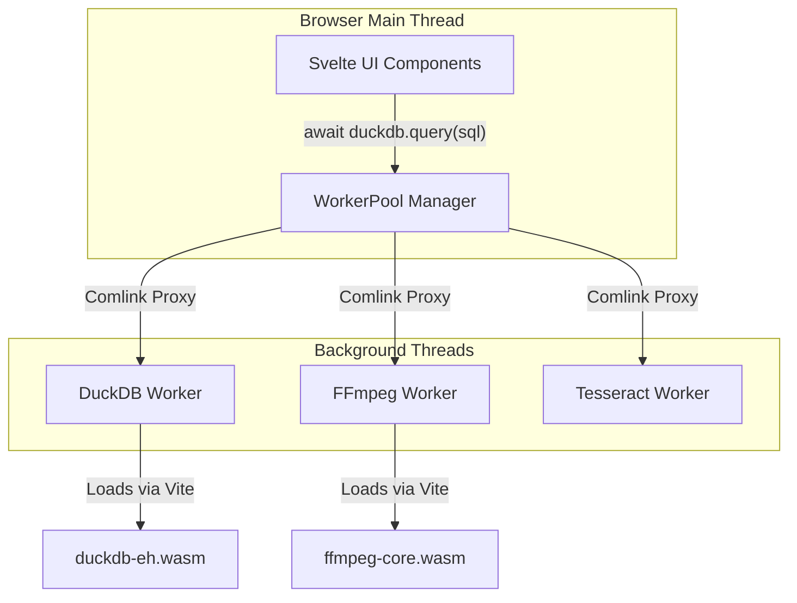

# Spec: Worker Pool Abstraction (v2)

## 1. Overview
The Worker Pool is the core architectural heartbeat of LocalMind. Because LocalMind loads heavy WebAssembly (WASM) engines (DuckDB, FFmpeg, Tesseract, Transformers.js) directly into the browser, executing them on the main thread would cause the Svelte UI to freeze. 

The Worker Pool ensures:
1. **Zero UI Blocking:** All WASM execution happens in dedicated Web Workers.
2. **Lazy Loading:** WASM bundles are only fetched and initialized Just-In-Time (JIT) when requested.
3. **Seamless Communication:** Main-thread to Worker communication is abstracted via Google's `Comlink`, allowing the UI to call WASM functions as if they were standard `async` functions.

## 2. Architecture Diagram



## 3. Core Technologies
*   **Web Workers API:** Native browser API for background threads.
*   **Comlink (by Google):** Wraps `postMessage` in an ES6 Proxy. 
*   **Vite WASM Plugins:** specifically `?worker` imports to allow Vite to bundle the workers correctly.

## 4. Implementation Details

### 4.1 The Worker Manager (`src/lib/workers/WorkerManager.ts`)
This class acts as a Singleton registry for all active workers. It ensures we don't accidentally spawn 5 DuckDB workers when the user navigates between pages.

```typescript
import { wrap } from 'comlink';

export class WorkerManager {
    private static instances: Map<string, Worker> = new Map();
    private static proxies: Map<string, any> = new Map();

    public static async getDuckDB() {
        if (!this.proxies.has('duckdb')) {
            // Lazy load the worker file ONLY when requested
            const worker = new Worker(new URL('./duckdb.worker.ts', import.meta.url), { type: 'module' });
            this.instances.set('duckdb', worker);
            
            // Wrap with Comlink
            const proxy = wrap(worker);
            await proxy.init(); // Wait for WASM instantiation
            this.proxies.set('duckdb', proxy);
        }
        return this.proxies.get('duckdb');
    }
}
```

### 4.2 The Worker Contract (`src/lib/workers/duckdb.worker.ts`)
Each worker exposes a class via `Comlink.expose()`. This acts as the API contract.

```typescript
import { expose } from 'comlink';
import * as duckdb from '@duckdb/duckdb-wasm';

class DuckDBService {
    private db: any = null;

    async init() {
        // Initialize DuckDB WASM here
        // This is only called once.
    }

    async executeQuery(query: string) {
        if (!this.db) throw new Error("DB not initialized");
        // Execute and return JSON
        return await this.db.query(query);
    }
}

expose(new DuckDBService());
```

### 4.3 Svelte UI Usage
Because of Comlink, the Svelte component doesn't need to deal with `onmessage` event listeners.

```svelte
<script lang="ts">
    import { WorkerManager } from '$lib/workers/WorkerManager';
    
    let result = null;

    async function runQuery() {
        // Automatically lazy-loads and initializes if it's the first time
        const db = await WorkerManager.getDuckDB();
        result = await db.executeQuery("SELECT * FROM table");
    }
</script>

<button on:click={runQuery}>Run Query</button>
```

## 5. Security & Invariants
1. **No Shared State:** Workers cannot access the DOM or Svelte stores. All data must be passed as arguments (preferably via `SharedArrayBuffer` for large datasets to avoid copy overhead).
2. **Graceful Termination:** The `WorkerManager` must include a `terminate(workerId)` method to kill a worker if it hangs (e.g., a user writes an infinite loop SQL query).
3. **Hardware Limits:** The manager should cap the number of active workers based on `navigator.hardwareConcurrency` to prevent CPU thrashing.
