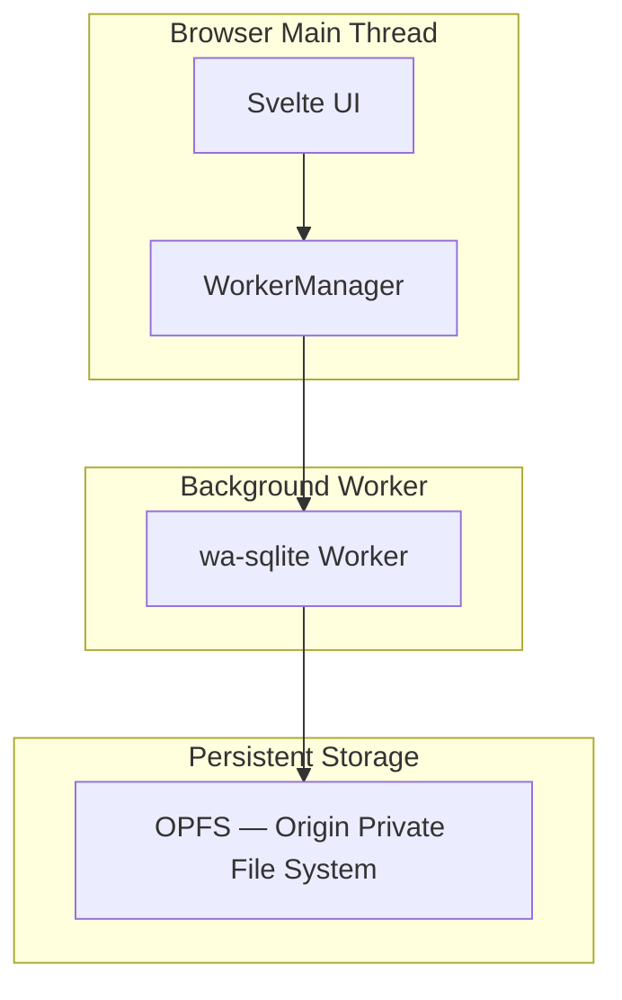

# Spec: wa-sqlite Workspace Persistence

## 1. Overview
LocalMind uses **wa-sqlite** (SQLite compiled to WASM) as its persistent local state store. It stores user workspaces, saved queries, registered file metadata, dashboard configs, and user preferences — all in the browser's **Origin Private File System (OPFS)**, giving unlimited, private, sandboxed storage.

This replaces fragile `localStorage` (5MB limit, string-only) with a fully relational, transactional database that survives browser restarts and tab closures.

## 2. Architecture



## 3. Schema

```sql
-- Saved Workspaces
CREATE TABLE IF NOT EXISTS workspaces (
    id TEXT PRIMARY KEY,
    name TEXT NOT NULL,
    created_at INTEGER DEFAULT (unixepoch()),
    updated_at INTEGER DEFAULT (unixepoch())
);

-- Registered file metadata (not the file itself)
CREATE TABLE IF NOT EXISTS registered_files (
    id TEXT PRIMARY KEY,
    workspace_id TEXT REFERENCES workspaces(id) ON DELETE CASCADE,
    file_name TEXT NOT NULL,
    table_name TEXT NOT NULL,
    file_size_bytes INTEGER,
    registered_at INTEGER DEFAULT (unixepoch())
);

-- Saved SQL queries
CREATE TABLE IF NOT EXISTS saved_queries (
    id TEXT PRIMARY KEY,
    workspace_id TEXT REFERENCES workspaces(id) ON DELETE CASCADE,
    name TEXT NOT NULL,
    sql TEXT NOT NULL,
    created_at INTEGER DEFAULT (unixepoch())
);

-- Dashboard panel layouts
CREATE TABLE IF NOT EXISTS dashboard_panels (
    id TEXT PRIMARY KEY,
    workspace_id TEXT REFERENCES workspaces(id) ON DELETE CASCADE,
    chart_config TEXT NOT NULL, -- JSON blob of ECharts config
    grid_position TEXT NOT NULL, -- JSON blob: {x, y, w, h}
    created_at INTEGER DEFAULT (unixepoch())
);

-- Global user preferences
CREATE TABLE IF NOT EXISTS preferences (
    key TEXT PRIMARY KEY,
    value TEXT NOT NULL -- JSON-serialized
);
```

## 4. Worker Contract

See `docs/contracts/cross_cutting/wa_sqlite_contract.md`.

## 5. Invariants
1. **wa-sqlite runs exclusively in a dedicated Web Worker** — the WASM engine must never be initialized on the main thread.
2. **OPFS is the only storage backend** — do not fall back to `localStorage` or IndexedDB for workspace data.
3. **Raw file contents are never stored** — only metadata. Actual file handles are re-requested from the user when a workspace is reopened.
4. **All writes are transactional** — wrap multi-step saves in `BEGIN; ... COMMIT;` to prevent partial writes on tab crash.
5. **Encryption at rest is optional** — future versions may use `WebCrypto.subtle` to encrypt the OPFS file, but this must not be implemented until Phase 7.
