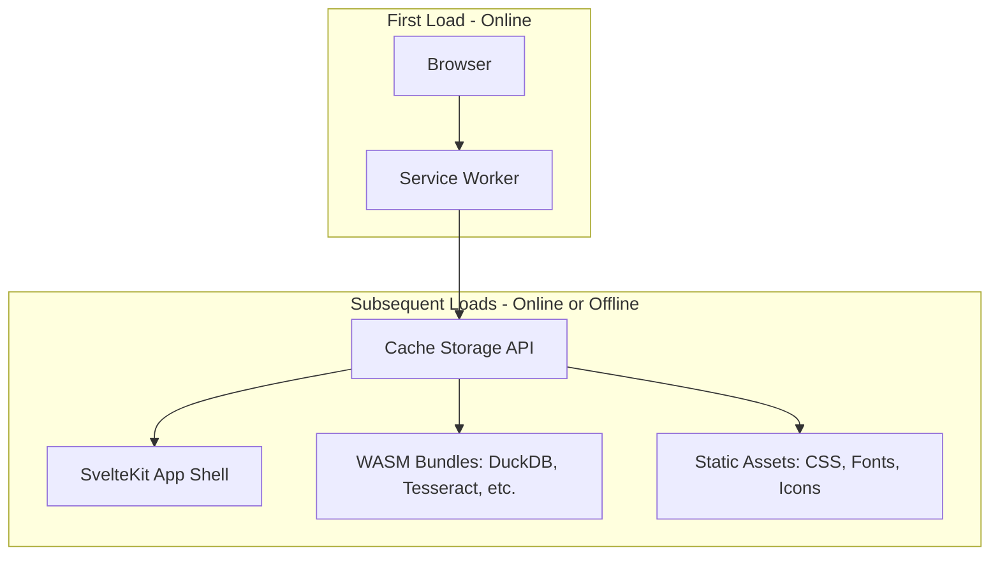

# Spec: PWA & Offline Support

## 1. Overview
LocalMind is deployed as a **Progressive Web App (PWA)** so that once a user has visited the site, the full application — including heavy WASM bundles — is available completely offline. This is critical because our target users (clinical researchers, defense contractors, journalists) may need to run the tool in air-gapped environments.

## 2. Architecture



## 3. Caching Strategy

| Resource Type | Strategy | Rationale |
|---|---|---|
| App shell (`index.html`, JS chunks) | **Cache-first with background update** | Instant load; update silently in background |
| WASM bundles (`*.wasm`) | **Cache-first, immutable** | These are large and versioned; never re-download unless version changes |
| API responses (AI cloud calls) | **Network-only** | AI responses must never be stale or cached |
| User data (OPFS) | **Not cached by SW** | Managed directly by wa-sqlite |

## 4. Web App Manifest (`static/manifest.json`)
```json
{
  "name": "LocalMind",
  "short_name": "LocalMind",
  "description": "Privacy-first local computation platform",
  "start_url": "/",
  "display": "standalone",
  "background_color": "#0a0a0f",
  "theme_color": "#7c3aed",
  "icons": [
    { "src": "/icons/icon-192.png", "sizes": "192x192", "type": "image/png" },
    { "src": "/icons/icon-512.png", "sizes": "512x512", "type": "image/png", "purpose": "maskable" }
  ]
}
```

## 5. Invariants
1. **COOP/COEP headers must be forwarded** by the Service Worker for all cached responses, or `SharedArrayBuffer` will be unavailable offline.
2. **WASM bundles must be pre-cached** at Service Worker install time — lazy-loading them on first use defeats the offline goal.
3. **Install prompt** (`beforeinstallprompt`) must be captured and stored; display a tasteful "Install App" button in the UI header.
4. **Update flow:** On detecting a new Service Worker waiting, show a non-blocking toast: "A new version is available. Reload to update." — never force-refresh.
5. **Offline banner:** When `navigator.onLine` is false, display a subtle status badge. All local processing features must remain fully functional.
