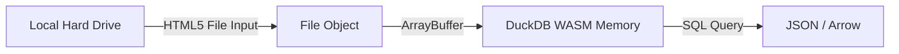

# Spec: Query Engine & Streams API (v2)

## 1. Objective
Enable LocalMind to query massive files (e.g., 5GB automotive telemetry CSVs) entirely in the browser without exceeding the V8 memory limit (typically 2-4GB per tab). We achieve this by avoiding `FileReader.readAsText()` and instead using the **File System Access API** combined with **Streams API** to pass chunks directly into DuckDB WASM.

## 2. Architecture



## 3. Implementation Flow

### 3.1 Obtaining the File Object
For maximum cross-browser compatibility (e.g., Firefox), we use standard `<input type="file">` elements. This provides a robust `File` object that can be passed to the worker.

```html
<input type="file" multiple accept=".csv,.json,.parquet" class="hidden" onchange={handleFileSelect} />
```

### 3.2 Registering the File with DuckDB
To ensure the file data persists across client-side SvelteKit route transitions (e.g., navigating to `/dashboard`), we load the file into memory via `arrayBuffer()` and use `registerFileBuffer`. Relying on `BROWSER_FILEREADER` with the `File` object directly can result in the browser revoking access when the `<input>` element unmounts.

```typescript
// Inside duckdb.worker.ts
import * as duckdb from '@duckdb/duckdb-wasm';

async function registerVirtualFile(file: File, tableName: string) {
    const buffer = new Uint8Array(await file.arrayBuffer());
    await db.registerFileBuffer(file.name, buffer);
    
    // Create a view or table from the registered file
    await conn.query(`CREATE VIEW ${tableName} AS SELECT * FROM read_csv_auto('${file.name}')`);
}
```

### 3.3 Memory Invariants
- Currently, using `arrayBuffer()` limits the maximum file size to available browser memory (typically ~2GB).
- For files larger than 1GB, future iterations may require OPFS (Origin Private File System) integration to stream directly from disk without risking `File` object revocation.
- Results returned from `query()` should be paginated (e.g., `LIMIT 1000`) to prevent the result set itself from crashing the UI thread.

### 3.4 HTML DOM Data Extraction (Task 14)
- **Objective:** Convert raw HTML source code into queryable DuckDB tables.
- **Pipeline:** `HTML Blob -> DOMParser -> Extract <table> / JSON-LD -> Array/Object -> Arrow Buffer -> DuckDB registerFileBuffer`.
- **Parsing:** Extract `<th>` as column names and `<td>` as rows.

### 3.5 Network & Graph Visualization (Task 13)
- **Objective:** Render complex entity relationships using `Cytoscape.js` or `Sigma.js`.
- **Data Flow:** Extract distinct `source` and `target` nodes from DuckDB results using `SELECT DISTINCT source FROM table`.
- **Render Engine:** WebGL accelerated graph rendering for >10,000 nodes.
