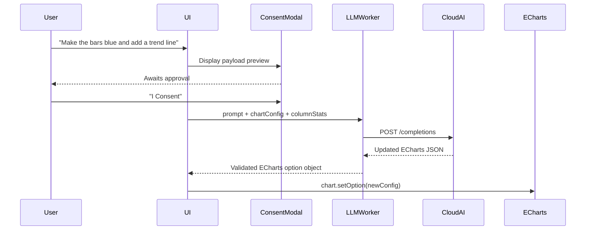

# Spec: AI-Assisted Chart Customization (Phase 1 — Task 5)

## 1. Objective
Allow users to describe chart changes in plain English and have a local or cloud LLM return a modified ECharts configuration that is applied instantly — without requiring the user to understand the ECharts API.

This feature is **strictly consent-gated**: the AI only receives aggregated column statistics and the current chart config, never raw row data.

## 2. Architecture



## 3. Payload Contract

What is sent to the AI (and shown in the consent modal):

```json
{
  "user_instruction": "Make the bars blue and add a trend line",
  "current_chart_type": "bar",
  "columns": ["month", "revenue"],
  "column_stats": {
    "month": { "type": "string", "unique_count": 12 },
    "revenue": { "type": "number", "min": 1200, "max": 84000, "avg": 42300 }
  },
  "current_echarts_config": { "...": "current option object" }
}
```

**Raw row data is never included.**

## 4. Response Validation
The LLM response must be parsed and validated before being applied:
1. `JSON.parse()` the response.
2. Verify the result is a plain object (not an array).
3. Verify it contains at least one of: `series`, `xAxis`, `yAxis`, `legend`, `title`.
4. If validation fails, display: "AI returned an invalid chart config. Please try rephrasing."

## 5. Local Mode (No Key Required)
If no API key is set, offer a local "chip suggestion" mode:
- Pre-computed ECharts config variations (color palettes, chart type swaps) rendered as clickable chips.
- No AI call, no consent required for chip suggestions.
- Chips are derived from the current chart type and column types.

## 6. Invariants
1. Raw data rows are **never** included in any AI payload.
2. The consent modal must be shown and confirmed before every AI call.
3. The LLM response must be validated before `chart.setOption()` is called — invalid JSON must be caught.
4. The AI key is held in-memory only — never written to `localStorage`.
