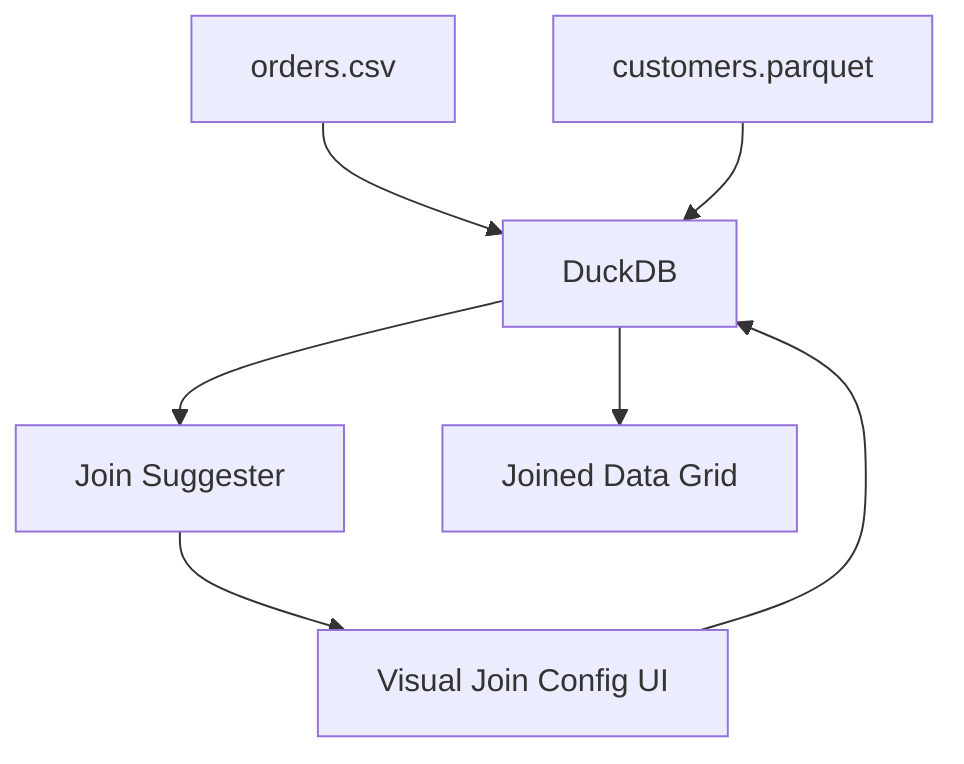

# Spec: Multi-File Auto-Joins & Visual Data Diffing (Phase 1 — Task 6)

## 1. Objective
Enable users to drag in two or more heterogeneous files (e.g., a CSV of orders and a Parquet of customers) and visually configure a SQL JOIN between them without writing SQL — and to compare two versions of the same dataset to highlight row-level changes.

## 2. Auto-Join Architecture



### 2.1 Join Key Auto-Detection
After registering multiple files, the `DuckDBWorkerContract.getSchema()` method returns column names and types for each table. The UI compares column names and types across tables:
- Exact name match → strongest suggestion (e.g., `customer_id` in both tables).
- Same type + name similarity (Levenshtein distance < 3) → medium suggestion.
- Present these as "Suggested Joins" with the JOIN key highlighted.

### 2.2 Join Types Supported
`INNER JOIN`, `LEFT JOIN`, `RIGHT JOIN`, `CROSS JOIN`.

### 2.3 SQL Generation
The visual join config generates a `SELECT ... FROM table_a {JOIN_TYPE} JOIN table_b ON table_a.{key} = table_b.{key}` query that is:
1. Displayed to the user in a read-only SQL panel (they can see exactly what is being run).
2. Executed via the DuckDB worker.

## 3. Visual Data Diffing

### 3.1 Diff Algorithm
Given two registered tables (`v1_data` and `v2_data`) with the same schema:
```sql
-- Added rows
SELECT * FROM v2_data EXCEPT SELECT * FROM v1_data;

-- Removed rows
SELECT * FROM v1_data EXCEPT SELECT * FROM v2_data;

-- Changed rows (requires a primary key column selected by user)
SELECT v2.*, v1.column AS old_value
FROM v2_data v2 JOIN v1_data v1 ON v2.{pk} = v1.{pk}
WHERE v2.{column} != v1.{column};
```

### 3.2 Display
Render a unified diff grid where:
- Added rows: green background.
- Removed rows: red background with strikethrough.
- Changed cells: yellow highlight showing `old → new`.

## 4. Invariants
1. Auto-join suggestions are advisory — users must explicitly confirm before the JOIN query executes.
2. The generated SQL is always shown to the user before execution.
3. Diffing requires both tables to have the same column names — a validation error is shown otherwise.
4. All JOIN operations execute in the DuckDB worker — the main thread only receives the paginated result.
