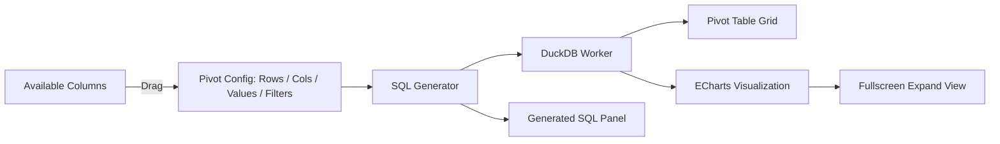

# Spec: Tableau-Style BI Pivot Builder (Phase 1 — Task 7)

## 1. Objective
Provide a drag-and-drop pivot table and chart builder where users assign columns to dimensions (rows/columns) and measures (values/aggregates) — generating SQL GROUP BY queries against DuckDB WASM and rendering results as pivot tables and ECharts visualizations with a premium Tableau-style aesthetic.

## 2. Architecture



## 3. Pivot Configuration

### 3.1 Shelf Definitions
- **Rows shelf:** Columns whose distinct values become row labels (GROUP BY these).
- **Columns shelf:** Columns whose distinct values become column headers (pivoted via DuckDB `PIVOT` syntax).
- **Values shelf:** Numeric columns with an aggregate function (SUM, AVG, COUNT, MIN, MAX).
- **Filters shelf:** Column + operator + value combinations to restrict the dataset before pivoting (e.g., `region = 'US'`, `revenue > 1000`).

### 3.2 SQL Generation

**Simple GROUP BY** (Rows + Values only):
```sql
SELECT region, SUM(revenue) AS SUM_revenue
FROM sales_data
GROUP BY region
ORDER BY region;
```

**Full PIVOT** (Rows + Columns + Values):
```sql
PIVOT (
    SELECT region, quarter, revenue
    FROM sales_data
)
ON quarter
USING SUM(revenue)
GROUP BY region
ORDER BY region;
```

**With Filters applied before pivot:**
```sql
PIVOT (
    SELECT region, quarter, revenue
    FROM sales_data
    WHERE region = 'US' AND revenue > 1000
)
ON quarter
USING SUM(revenue)
GROUP BY region
ORDER BY region;
```

**COUNT wildcard rule (Invariant):**
When a user adds a COUNT aggregate with the special wildcard column (`*`), the SQL generator **MUST NOT** wrap the `*` in double quotes. The output must be `COUNT(*)` not `COUNT("*")`. DuckDB treats double-quoted identifiers as column names, so `COUNT("*")` raises a `Binder Error: Referenced column "*" not found`. The `*` character must be emitted as a bare SQL token.

## 4. Visualization Binding
After DuckDB returns the pivot result:
- **Pivot Table:** rendered in a sticky-header grid with a grand totals row at the bottom. Paginated at 1,000 rows.
- **Chart binding:** each `Values` measure maps to a chart series.
  - Default chart type is auto-selected by data cardinality: ≤ 5 categories → Pie; ≤ 20 categories → Bar; > 20 categories → Line.
  - User can manually override chart type via an icon selector (Supported: Auto, Bar, Line, Pie, Scatter, Area). If invalid configuration is provided for a chart type (e.g. Pie chart with multiple measures), the visualization gracefully degrades to the first dimension/measure.

### 4.1 Visualization Aesthetic (Tableau-Style Premium)
The ECharts visualization **must** implement a premium Tableau-inspired aesthetic:

- **Color Palette:** Default to the Tableau-10 categorical palette. Users can switch palette at any time.
- **Typography:** All chart labels, tooltips, and legends must use the application's primary font stack (`'Inter', 'Outfit', system-ui, sans-serif`).
- **Tooltips:** White background (`#ffffff`), 1px `#e5e7eb` border, 10px border-radius, 16px blur drop shadow. Rich formatted content: bold measure name, formatted numeric value, optional percentage for pie.
- **Grid Lines:** Y-axis uses soft dashed `#f3f4f6` split lines only. X-axis has no split lines. No hard axis borders.
- **Bar Charts:** Bars have `borderRadius: [4, 4, 0, 0]` (rounded top corners). Hover state adds a soft shadow glow.
- **Pie Charts:** Rendered as a donut (inner radius 35%, outer 68%) with 3px `padAngle` spacing between segments and a 6px `borderRadius` per segment. Labels show `name: percentage`.
- **Line/Area Charts:** Lines must be `smooth: true`. Area fill uses `opacity: 0.18`.
- **Background:** All charts use `backgroundColor: 'transparent'` to integrate cleanly with dark/light card backgrounds.

### 4.2 Color Customization
Users must be able to customize chart colors without touching any configuration files.

**Named Palette Presets** (selectable via palette swatch picker in the visualization toolbar):

| Palette Name | Colors |
|---|---|
| Tableau | `#4E79A7 #F28E2B #E15759 #76B7B2 #59A14F #EDC948 #B07AA1 #FF9DA7 #9C755F #BAB0AC` |
| Material | `#2196F3 #FF5722 #4CAF50 #9C27B0 #FF9800 #00BCD4 #F44336 #3F51B5 #009688 #FFEB3B` |
| Pastel | `#AEC6CF #FFD1DC #B5EAD7 #FFDAC1 #C7CEEA #E2B8B8 #D4E8C2 #F7D59C #C9C4E5 #FDE8C8` |
| Ocean | `#005F73 #0A9396 #94D2BD #E9D8A6 #EE9B00 #CA6702 #BB3E03 #AE2012 #9B2226 #001219` |
| Vibrant | `#E63946 #F4A261 #2A9D8F #264653 #E9C46A #A8DADC #457B9D #1D3557 #F1FAEE #6D6875` |
| Monochrome | `#0D1B2A #1B2A3B #2E4057 #3D5A80 #5A7FA0 #88A8BE #B0C8D9 #D0DDE8 #E8EFF4 #F5F8FA` |

**Implementation Requirements:**
- A palette swatch picker is shown in the chart toolbar (both inline and fullscreen views).
- Clicking a palette name shows 10 color swatches as small circles in a popover. Clicking confirms the selection.
- The selected palette name is persisted in local component state and passed to `buildEchartsOption()` as a `colors` parameter.
- The default palette is **Tableau** on first load.
- The palette selector is also accessible from within the fullscreen Chart Explorer modal.

### 4.3 Fullscreen Visualization Modal
The chart panel must include a dedicated **fullscreen expand button** (⛶ icon) in the visualization toolbar.

- On click, the chart transitions into a full-viewport fixed-position modal overlay (`z-index: 50`).
- The modal has a semi-transparent dark backdrop (`rgba(0,0,0,0.6)`).
- The chart canvas is re-rendered at full size by triggering `chartInstance.resize()` after the transition.
- A close button (✕) in the top-right corner of the modal collapses it back to the inline view.
- The modal does **not** re-execute the SQL query; it reuses the same `result` object from the parent `PivotBuilder` state, so the expand/collapse is instant.
- Keyboard shortcut `Escape` also closes the modal.

## 5. Generated SQL Panel
- A collapsible panel labeled "Generated SQL" always displays the exact SQL sent to DuckDB.
- The SQL is copyable (click-to-copy button).
- This ensures full transparency — no hidden queries.

## 6. Invariants
1. The pivot SQL is always displayed in the Generated SQL panel — no hidden queries.
2. Columns shelf is limited to columns with ≤ 50 distinct values to prevent ECharts rendering millions of series.
3. Pivot results are paginated at 1,000 rows in the grid — the full result set is queryable via the SQL panel.
4. An empty pivot config (no Values shelf) does not execute a query — show an empty state prompt: "Drag columns to Rows and Values to start building your pivot."
5. Grand totals row computes aggregates across all visible rows.
6. Filter operators supported: `=`, `!=`, `>`, `<`, `>=`, `<=`, `LIKE`, `IN`.
7. **COUNT wildcard:** `COUNT(*)` must never be quoted as `COUNT("*")`. The `*` wildcard is always emitted bare.
8. The fullscreen modal must not trigger a new DuckDB query — it reuses the existing in-memory result.

## 7. Component Architecture

The PivotBuilder is decomposed into focused, reusable child components:

```
src/lib/components/pivot/
├── PivotBuilder.svelte       — Orchestrator (state container)
├── ColumnPanel.svelte        — Column list with type icons & preview tooltips
├── ShelfZone.svelte          — Reusable drop zone (Rows / Columns / Values / Filters)
├── ShelfPill.svelte          — Individual draggable pill (color-coded)
├── PivotChart.svelte         — ECharts + chart type selector + fullscreen modal
├── PivotTable.svelte         — Data table with totals, pagination, sorting
├── SQLPanel.svelte           — Collapsible SQL viewer with copy button
├── FilterEditor.svelte       — Filter operator + value editor
└── pivot.types.ts            — Shared TypeScript interfaces
```

The chart rendering logic is centralized in:
```
src/lib/utils/chartBuilder.ts  — Pure function: (result, chartType, rows, values) → ECharts option
```

### UX Requirements
- Column panel shows type icons (🔢 numeric, 🔤 text, 📅 date, 🔘 boolean) and hover preview tooltips with sample values.
- Drop zones glow/pulse during drag hover.
- Shelf pills are color-coded: Rows=blue, Columns=purple, Values=green, Filters=orange.
- Split-pane layout: chart on left, table on right (or stacked in compact mode).
- Dark mode compatible via CSS custom properties or Tailwind `dark:` variants.
- Micro-animations on pill add/remove and panel expand/collapse.
- Visualization toolbar includes: Chart type selector icons + Fullscreen expand button.
