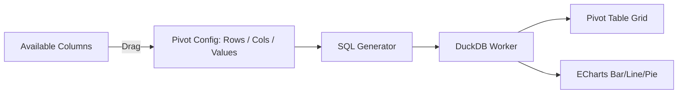

# Spec: Tableau-Style BI Pivot Builder (Phase 1 — Task 7)

## 1. Objective
Provide a drag-and-drop pivot table and chart builder where users assign columns to dimensions (rows/columns) and measures (values/aggregates) — generating SQL GROUP BY queries against DuckDB WASM and rendering results as pivot tables and ECharts visualizations.

## 2. Architecture



## 3. Pivot Configuration

### 3.1 Shelf Definitions
- **Rows shelf:** Columns whose distinct values become row labels (GROUP BY these).
- **Columns shelf:** Columns whose distinct values become column headers (pivoted via DuckDB `PIVOT` syntax).
- **Values shelf:** Numeric columns with an aggregate function (SUM, AVG, COUNT, MIN, MAX).
- **Filters shelf:** Column + value combinations to restrict the dataset before pivoting.

### 3.2 SQL Generation Example
Config: Rows=`region`, Columns=`quarter`, Values=`SUM(revenue)`:
```sql
PIVOT (
    SELECT region, quarter, revenue
    FROM sales_data
)
ON quarter
USING SUM(revenue)
GROUP BY region
ORDER BY region;
```

## 4. Visualization Binding
After DuckDB returns the pivot result:
- **Pivot Table:** rendered in a sticky-header grid with totals row.
- **Chart binding:** each `Values` measure maps to a chart series.
  - Default chart type is auto-selected by data cardinality: ≤ 5 categories → Pie; ≤ 20 categories → Bar; > 20 categories → Line.
  - User can manually override chart type via a dropdown selector (Supported: Bar, Line, Pie, Scatter, Area). If invalid configuration is provided for a chart type (e.g. Pie chart with multiple measures), the visualization gracefully degrades or takes the first dimension/measure.

## 5. Invariants
1. The pivot SQL is always displayed in a collapsible "Generated SQL" panel — no hidden queries.
2. Columns shelf is limited to columns with ≤ 50 distinct values to prevent ECharts rendering millions of series.
3. Pivot results are paginated at 1,000 rows in the grid — the full result set is queryable via the SQL panel.
4. An empty pivot config (no Values shelf) does not execute a query — show an empty state prompt.
