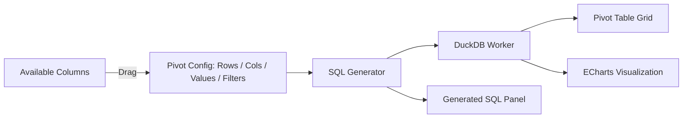

# Spec: Tableau-Style BI Pivot Builder (Phase 1 — Task 7)

## 1. Objective
Provide a drag-and-drop pivot table and chart builder where users assign columns to dimensions (rows/columns) and measures (values/aggregates) — generating SQL GROUP BY queries against DuckDB WASM and rendering results as pivot tables and ECharts visualizations.

## 2. Architecture



## 3. Pivot Configuration

### 3.1 Shelf Definitions
- **Rows shelf:** Columns whose distinct values become row labels (GROUP BY these).
- **Columns shelf:** Columns whose distinct values become column headers (pivoted via DuckDB `PIVOT` syntax).
- **Values shelf:** Numeric columns with an aggregate function (SUM, AVG, COUNT, MIN, MAX).
- **Filters shelf:** Column + operator + value combinations to restrict the dataset before pivoting (e.g., `region = 'US'`, `revenue > 1000`).

### 3.2 SQL Generation

**Simple GROUP BY** (Rows + Values only):
```sql
SELECT region, SUM(revenue) AS SUM_revenue
FROM sales_data
GROUP BY region
ORDER BY region;
```

**Full PIVOT** (Rows + Columns + Values):
```sql
PIVOT (
    SELECT region, quarter, revenue
    FROM sales_data
)
ON quarter
USING SUM(revenue)
GROUP BY region
ORDER BY region;
```

**With Filters applied before pivot:**
```sql
PIVOT (
    SELECT region, quarter, revenue
    FROM sales_data
    WHERE region = 'US' AND revenue > 1000
)
ON quarter
USING SUM(revenue)
GROUP BY region
ORDER BY region;
```

## 4. Visualization Binding
After DuckDB returns the pivot result:
- **Pivot Table:** rendered in a sticky-header grid with a grand totals row at the bottom. Paginated at 1,000 rows.
- **Chart binding:** each `Values` measure maps to a chart series.
  - Default chart type is auto-selected by data cardinality: ≤ 5 categories → Pie; ≤ 20 categories → Bar; > 20 categories → Line.
  - User can manually override chart type via a dropdown selector (Supported: Bar, Line, Pie, Scatter, Area). If invalid configuration is provided for a chart type (e.g. Pie chart with multiple measures), the visualization gracefully degrades or takes the first dimension/measure.

## 5. Generated SQL Panel
- A collapsible panel labeled "Generated SQL" always displays the exact SQL sent to DuckDB.
- The SQL is copyable (click-to-copy button).
- This ensures full transparency — no hidden queries.

## 6. Invariants
1. The pivot SQL is always displayed in the Generated SQL panel — no hidden queries.
2. Columns shelf is limited to columns with ≤ 50 distinct values to prevent ECharts rendering millions of series.
3. Pivot results are paginated at 1,000 rows in the grid — the full result set is queryable via the SQL panel.
4. An empty pivot config (no Values shelf) does not execute a query — show an empty state prompt: "Drag columns to Rows and Values to start building your pivot."
5. Grand totals row computes aggregates across all visible rows.
6. Filter operators supported: `=`, `!=`, `>`, `<`, `>=`, `<=`, `LIKE`, `IN`.

## 7. Component Architecture

The PivotBuilder must be decomposed into focused, reusable child components:

```
src/lib/components/pivot/
├── PivotBuilder.svelte       — Orchestrator (state container)
├── ColumnPanel.svelte        — Column list with type icons & preview tooltips
├── ShelfZone.svelte          — Reusable drop zone (Rows / Columns / Values / Filters)
├── ShelfPill.svelte          — Individual draggable pill (color-coded)
├── PivotChart.svelte         — ECharts + chart type selector
├── PivotTable.svelte         — Data table with totals, pagination, sorting
├── SQLPanel.svelte           — Collapsible SQL viewer with copy button
├── FilterEditor.svelte       — Filter operator + value editor
└── pivot.types.ts            — Shared TypeScript interfaces
```

### UX Requirements
- Column panel shows type icons (🔢 numeric, 🔤 text, 📅 date, 🔘 boolean) and hover preview tooltips with sample values.
- Drop zones glow/pulse during drag hover.
- Shelf pills are color-coded: Rows=blue, Columns=purple, Values=green, Filters=orange.
- Split-pane layout: chart on top, table on bottom.
- Dark mode compatible via CSS custom properties or Tailwind `dark:` variants.
- Micro-animations on pill add/remove and panel expand/collapse.
