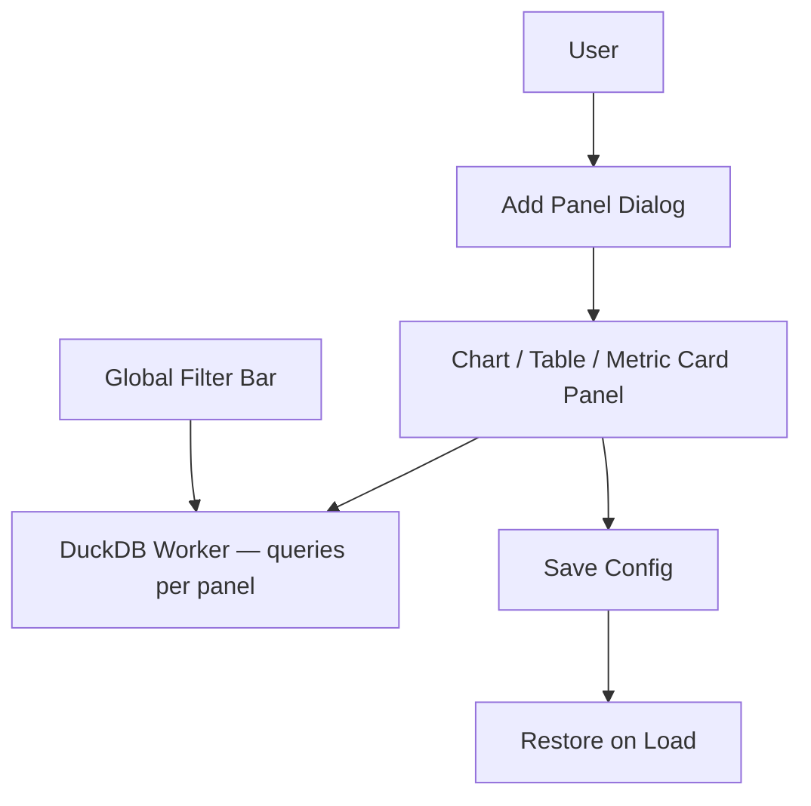

# Spec: Interactive Dashboard Builder (Phase 1 — Task 8)

## 1. Objective
Allow users to compose multiple charts, pivot tables, and metric cards onto a free-form grid dashboard, linked by global filters, with layout and config persisted via wa-sqlite.

## 2. Architecture

## 3. Panel Types

| Panel Type | Description |
|---|---|
| **Chart Panel** | Any ECharts chart from the Analytics workspace |
| **Pivot Table Panel** | A frozen pivot table from the BI Pivot builder |
| **Metric Card** | A single KPI number with a label and trend arrow |
| **SQL Panel** | A custom SQL query result rendered as a mini-grid |

## 4. Grid Layout
- Use `svelte-grid` or CSS Grid with drag-and-drop resize handles.
- Each panel has a `{x, y, w, h}` position in a 12-column grid.
- Layout is serialized to JSON and stored in wa-sqlite `dashboard_panels` table.

## 5. Global Filter Bar
- Users can add dimension filters to a top bar (e.g., "Region = West", "Date ≥ 2024-01-01").
- On filter change, all panels re-execute their queries with the filter applied as a `WHERE` clause.
- Filters are appended to the generated SQL dynamically — they do not modify stored queries.

## 6. Panel Query Isolation
Each panel runs its own independent DuckDB query. Panel queries must:
- Execute concurrently (don't serialize — DuckDB WASM supports concurrent reads).
- Show a loading skeleton independently while their query is running.
- Show an error state inline if the query fails (e.g., a referenced table was dropped).

## 7. Invariants
1. Dashboard state (layout + panel configs) is persisted to wa-sqlite on every panel save.
2. Panel queries must reference tables registered in the current workspace — not hardcoded table names.
3. Global filters must be applied as parameterized query additions, never by string concatenation into stored SQL.
4. A dashboard with 0 panels shows an empty state with an "Add your first panel" prompt.
