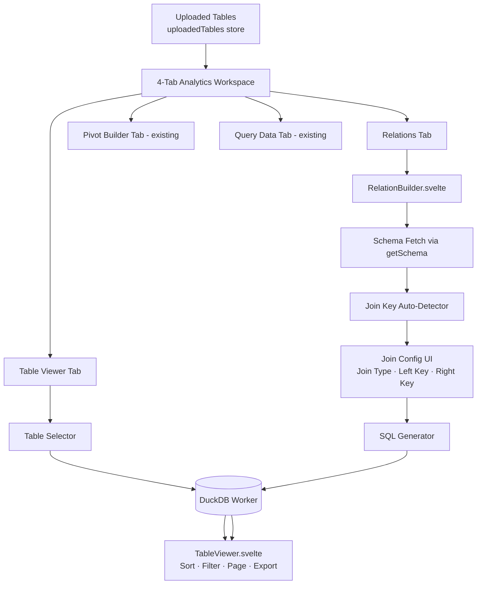

# Spec: Analytics Table Viewer & Cross-Table Relations (Phase 1 — Task 18)

## 1. Objective

Provide a first-class **Table Viewer** and **Relations** experience inside the Analytics workspace so users can:

1. Browse any uploaded table as a rich, interactive data grid (sort, filter, paginate, export) — with **zero SQL required**.
2. Visually configure and execute a JOIN between two uploaded tables, with auto-detected join keys and a transparent SQL preview.

---

## 2. Architecture Overview



---

## 3. Component Tree

```
src/lib/components/analytics/
├── TableViewer.svelte        ← Reusable data grid (used in both tabs)
└── RelationBuilder.svelte    ← Visual JOIN builder
```

The Analytics Workspace tab bar is managed in `AnalyticsWorkspace.svelte`.

---

## 4. TableViewer Component

### 4.1 Props Interface

```typescript
interface TableViewerProps {
  result: QueryResult | null;   // From DuckDB worker
  loading: boolean;
  caption?: string;             // Optional label above the grid
}
```

### 4.2 Features

| Feature | Behaviour |
|---|---|
| Sticky column headers | Header row fixed while scrolling vertically |
| Column type badges | `#` (numeric), `T` (text), `📅` (date/timestamp), `?` (boolean/other) — inferred from value sampling |
| Global search | Client-side text filter across all columns. Debounced 150ms. |
| Column sorting | Click header to sort asc; click again desc; click again unsorted. Chevron indicator. |
| Pagination | Page sizes: 25 / 50 / 100. Shows "Showing 1–50 of 1,432 rows". |
| NULL cells | Rendered as `—` pill with muted colour (not blank) |
| CSV Export | Downloads the *currently filtered* rows only as UTF-8 CSV |
| Row count badge | `{filteredCount} of {totalCount} rows` |
| Diff row colouring | If a column `_diff_status` exists: green row = added, red + strikethrough = removed |

### 4.3 Invariants

1. All filtering and sorting is **client-side** on the already-fetched `QueryResult`. No additional DuckDB queries.
2. The component is **stateless from the parent's perspective** — it only reads `result` and `loading`.
3. The CSV export filename defaults to `localmind_export_<timestamp>.csv`.

---

## 5. RelationBuilder Component

### 5.1 Props Interface

```typescript
interface RelationBuilderProps {
  tables: string[];                        // From uploadedTables store
  onResult: (result: QueryResult) => void; // Emits joined result upward
}
```

### 5.2 Join Key Auto-Detection Algorithm

After the user selects Table A and Table B:

1. Fetch `getSchema(tableA)` and `getSchema(tableB)` from the DuckDB worker.
2. **Exact name match** (case-insensitive): columns sharing the same name → `confidence: HIGH`.
3. **Type-compatible near-match**: same DuckDB type + Levenshtein distance ≤ 2 → `confidence: MEDIUM`.
4. Present suggestions ranked HIGH → MEDIUM. Pre-populate key dropdowns with the top suggestion.
5. If no suggestions: leave dropdowns empty, show hint "No common columns detected — select join keys manually".

### 5.3 Join Types Supported

`INNER JOIN` · `LEFT JOIN` · `RIGHT JOIN` · `FULL OUTER JOIN`

### 5.4 SQL Generation

```sql
-- Template:
SELECT a.*, {b_exclusive_cols}
FROM {tableA} AS a
{JOIN_TYPE} JOIN {tableB} AS b
ON a.{leftKey} = b.{rightKey}
```

- `{b_exclusive_cols}`: all columns in Table B that do **not** share a name with Table A (avoids duplicate column names).
- Generated SQL is always shown in a **read-only code block** before execution.
- User must explicitly click **"Preview Join"** — query never fires automatically.

### 5.5 Invariants

1. Auto-detected join keys are advisory — user must confirm before query executes.
2. Generated SQL is always visible before execution.
3. All JOIN execution happens inside the DuckDB worker; main thread only receives `QueryResult`.
4. If Table A or Table B is unset, "Preview Join" button is disabled.

---

## 6. Analytics Workspace Tab Bar

### 6.1 Tabs

| Tab ID | Label | Content |
|---|---|---|
| `table` | 📋 Table Viewer | Table selector + TableViewer |
| `relations` | 🔗 Relations | RelationBuilder + TableViewer for output |
| `pivot` | 📊 Pivot Builder | Existing PivotBuilder (unchanged) |
| `query` | 💻 Query Data | Existing SQL textarea + results (unchanged) |

### 6.2 State

```typescript
let activeAnalyticsTab = $state<'table' | 'relations' | 'pivot' | 'query'>('table');
```

- Default tab on load: `table`.
- The **Data Ingestion** section (drag-and-drop upload) remains **above the tab bar**, always visible.

---

## 7. Acceptance Criteria

- [ ] Table Viewer tab: select any uploaded table → full data grid renders with sort, filter, pagination.
- [ ] Clicking a column header sorts rows; second click reverses; third clears sort.
- [ ] Global search filters all visible rows across all columns, debounced 150ms.
- [ ] Pagination controls work; page-size selector changes rows per page.
- [ ] "Export CSV" downloads only the currently filtered rows.
- [ ] Relations tab: select two tables → auto-detected join key pre-fills dropdowns.
- [ ] Generated SQL is displayed before execution.
- [ ] "Preview Join" fires the query and renders result in TableViewer below.
- [ ] All four join types produce correct results.
- [ ] Pivot Builder and Query Data tabs function exactly as before (no regressions).
- [ ] Unit tests for TableViewer.svelte and RelationBuilder.svelte.
