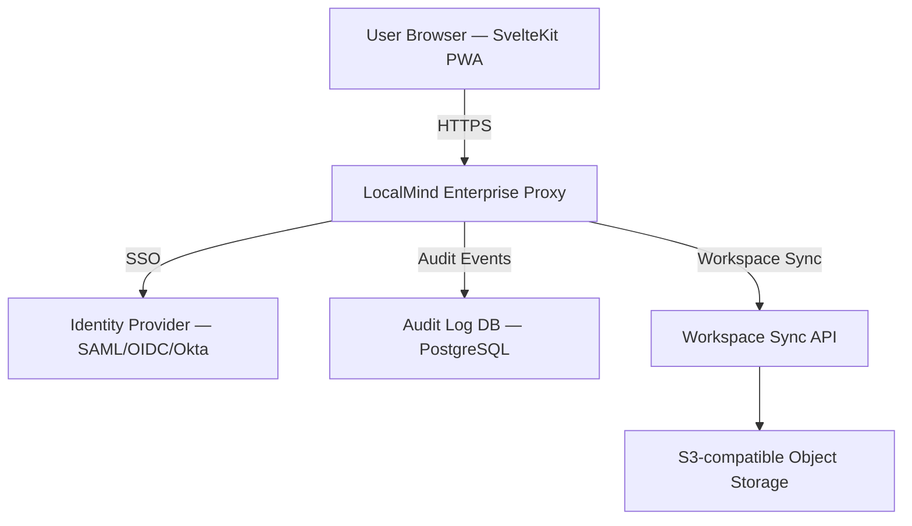

# Spec: Phase 10 — Enterprise Tier (On-Premise & Governance)

## 1. Overview
The LocalMind Enterprise tier adds multi-user team workspaces, SSO authentication, audit logging, and on-premise deployment capabilities. It is deployed as a Docker/Kubernetes service, not as a SaaS.

## 2. Architecture



## 3. Features

### 3.1 SSO Authentication (SAML / OIDC)
- Implement a Cloudflare Worker (or Node.js Express) authentication gateway.
- Support: Okta, Azure AD (Entra), Google Workspace, and any SAML 2.0 / OIDC provider.
- The browser app redirects unauthenticated users to the SSO login page.
- After authentication, a short-lived JWT is issued to the browser (1-hour expiry, RS256-signed).

### 3.2 Team Workspaces & RBAC
- Workspace roles: `Owner`, `Editor`, `Viewer`.
- Owners can: create/delete workspaces, invite members, manage RBAC.
- Editors can: save queries, create dashboard panels, upload files.
- Viewers can: view dashboards and query results; cannot save or export.
- Role assignments are stored server-side and validated by the proxy on every API call.

### 3.3 Audit Logging
Every sensitive action must be logged to the audit database:

```typescript
interface AuditEvent {
    eventId: string;        // UUID
    userId: string;         // SSO subject
    action: AuditAction;    // see below
    resourceType: string;   // 'workspace' | 'file' | 'query' | 'ai_request'
    resourceId: string;
    timestamp: string;      // ISO 8601
    ipAddress: string;
    metadata?: object;      // action-specific details
}

type AuditAction =
    | 'workspace.create' | 'workspace.delete'
    | 'file.register' | 'file.access'
    | 'query.execute' | 'query.export'
    | 'ai.consent_given' | 'ai.request_sent'
    | 'user.login' | 'user.logout'
    | 'rbac.role_changed';
```

### 3.4 On-Premise Deployment

```
docker-compose.yml provides:
  - localmind-app: SvelteKit SSR container (Node 20 Alpine)
  - localmind-proxy: Auth + audit proxy (Rust / Go)
  - postgres: Audit log and workspace metadata store
  - minio: S3-compatible object storage for shared workspaces
```

## 4. Contracts
See `docs/contracts/phase-10/`:
- `sso_contract.md` — JWT claims schema.
- `audit_contract.md` — AuditEvent schema and retention policy.
- `rbac_contract.md` — role permission matrix.

## 5. Invariants
1. **The enterprise proxy never touches user file data** — only workspace metadata and audit events.
2. **WASM processing remains local** — the enterprise proxy adds auth/audit, not cloud processing.
3. **Audit logs are append-only** — no DELETE or UPDATE on the `audit_events` table.
4. **JWT tokens must be validated on every proxied API call** — no "session cookie" alternative.
5. **Air-gapped mode:** Configuring `DISABLE_EXTERNAL_NETWORK=true` disables AI cloud features entirely; the enterprise app functions fully offline.
