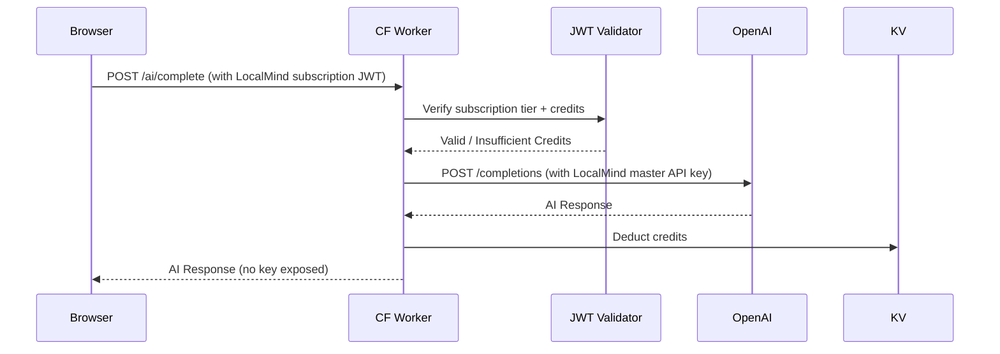

# Spec: Phase 11 — Monetization Proxy (Cloudflare)

## 1. Overview
The LocalMind Monetization Proxy is a stateless Cloudflare Worker that acts as a secure, zero-logging intermediary between the LocalMind browser app and AI providers (OpenAI, Anthropic). It enables a subscription-funded AI Credits model, eliminating the need for users to manage their own API keys.

## 2. Architecture



## 3. Proxy API Contract

### POST `/api/ai/complete`
**Headers:**
```
Authorization: Bearer <localmind-subscription-jwt>
Content-Type: application/json
```

**Request Body:**
```typescript
interface ProxyRequest {
    provider: 'openai' | 'anthropic';
    model: string;          // e.g. 'gpt-4o-mini'
    messages: ChatMessage[];
    max_tokens?: number;
    stream?: boolean;
}
```

**Response:** Streamed or buffered response forwarded directly from the AI provider.

**Error Responses:**
```json
// 402 Payment Required
{ "error": "insufficient_credits", "credits_remaining": 0 }

// 401 Unauthorized
{ "error": "invalid_token" }

// 429 Rate Limited
{ "error": "rate_limit_exceeded", "retry_after": 60 }
```

## 4. Cloudflare Workers KV Schema
```
kv namespace: LOCALMIND_CREDITS
  key: user:{userId}:credits  → integer (remaining credits)
  key: user:{userId}:tier     → 'free' | 'pro' | 'enterprise'
  key: user:{userId}:reset_at → Unix timestamp (monthly credit reset)
```

## 5. Stripe Billing Integration
- `POST /billing/checkout` → creates a Stripe Checkout Session for Pro or AI Credits top-up.
- `POST /billing/webhook` → Stripe webhook handler; on `payment_intent.succeeded` → credit top-up via KV.
- `GET /billing/usage` → returns the user's current credit balance and tier.

## 6. Zero-Logging Policy
The proxy is designed to log **nothing** about the content of AI requests:
- No request bodies are logged.
- No response bodies are logged.
- Only metadata is logged: `userId`, `timestamp`, `provider`, `model`, `tokens_used` (for billing).
- Cloudflare Worker logs are disabled in the `wrangler.toml` production environment.

## 7. Invariants
1. **The master API key is stored only as a Cloudflare Secret** — never in the Worker code or `wrangler.toml`.
2. **The proxy is stateless** — no database beyond KV. All user session state is in the JWT.
3. **The proxy does not read, store, or modify the AI payload** — it forwards it verbatim after auth.
4. **BYOK always takes precedence** — if the user provides their own API key in-browser, the proxy is not called.
5. **Rate limiting:** 60 requests/minute per user enforced via Cloudflare's built-in rate limiting rules.
