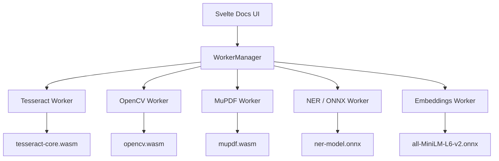

# Spec: Phase 2 — LocalMind Docs (Document Processing Engine)

## 1. Overview
LocalMind Docs is the second core product vertical, enabling users to process PDFs, scanned images, and DOCX files entirely in the browser using WASM engines. All OCR, redaction, extraction, and manipulation happens locally — no cloud upload is ever required.

## 2. WASM Engines

| Engine | Package | Purpose |
|---|---|---|
| Tesseract.js | `tesseract.js` | OCR — extract text from scanned images/PDFs |
| OpenCV.js | `@techstark/opencv-js` | Image pre-processing (deskew, denoise, enhance contrast) |
| MuPDF WASM | `mupdf` | PDF merge, split, compress, redact, annotate |
| ONNX Runtime Web | `onnxruntime-web` | NER model for PII detection |
| Transformers.js | `@xenova/transformers` | Local embeddings for semantic search |

## 3. Architecture



## 4. Processing Pipeline

### 4.1 PDF → Text Extraction
```
PDF File → MuPDF (extract embedded text) → 
    If no embedded text → Render to image → Tesseract OCR
→ Plain text output
```

### 4.2 Scanned Image → Text (with Enhancement)
```
Raw Image → OpenCV (deskew + denoise + binarize) → 
Enhanced Image → Tesseract OCR → Plain text output
```

### 4.3 PII Redaction Pipeline
```
Text → ONNX NER Model (detect: PERSON, EMAIL, PHONE, SSN) →
Highlight overlays on PDF → User confirms → MuPDF burns redaction
```

### 4.4 Semantic Search Pipeline
```
Corpus of Documents → Transformers.js (embed chunks) →
Store vectors in wa-sqlite → User query → embed query →
Cosine similarity search → Ranked results
```

## 5. Worker Contracts
See `docs/contracts/phase-2/`:
- `tesseract_worker_contract.md`
- `mupdf_worker_contract.md`
- `ner_worker_contract.md`
- `embeddings_worker_contract.md`

## 6. Invariants
1. **File objects are passed directly** to workers via Comlink — never read into memory on the main thread.
2. **OCR confidence threshold**: Only display results with confidence ≥ 60%. Warn user if below 80%.
3. **PII redaction is destructive and irreversible** — always present a confirmation modal before burning redactions.
4. **Embedding vectors are stored in wa-sqlite** via a `document_chunks` table — not IndexedDB.
5. **All WASM engines must be lazy-loaded** — OCR must not be fetched until the user drops a document.
