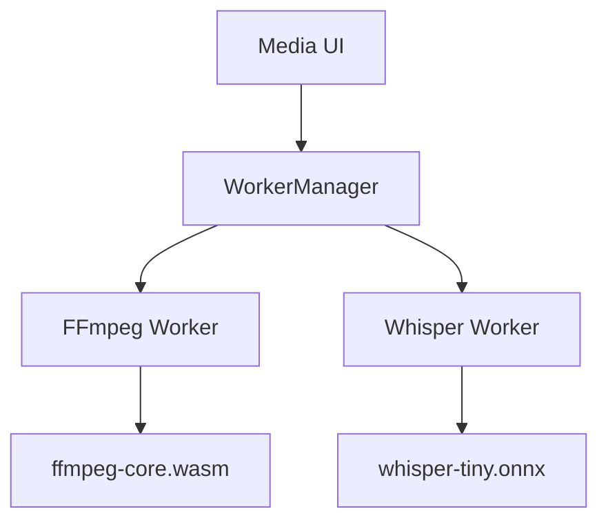

# Spec: Phase 3 — LocalMind Media (FFmpeg & Audio/Video Processing)

## 1. Overview
LocalMind Media is a future plugin providing video transcoding, audio extraction, thumbnail generation, and speech-to-text transcription — all running locally via FFmpeg WASM and Whisper WASM. No video or audio file is ever uploaded.

## 2. WASM Engines

| Engine | Package | Purpose |
|---|---|---|
| FFmpeg WASM | `@ffmpeg/ffmpeg` | Video/audio transcoding, compression, format conversion |
| Whisper WASM | `@xenova/transformers` (whisper-tiny) | Offline speech-to-text transcription |

## 3. Architecture



## 4. Supported Operations

### 4.1 Video
- **Transcode:** Convert any format (MKV, AVI, MOV, WebM) to MP4 (H.264) or WebM (VP9).
- **Proxy Generation:** Create a 720p proxy from a 4K source for quick preview.
- **Frame Extraction:** Extract a specific frame as PNG (for thumbnail generation).
- **Audio Extraction:** Rip the audio track from a video file as MP3 or WAV.
- **Clip Trimming:** Cut a time range from a video (`-ss start -to end`).

### 4.2 Audio & Subtitles
- **Transcription:** Run Whisper (tiny/base model) on an audio file to produce a timestamped SRT or plain-text transcript.
- **Interactive Subtitles (Task 8):** Dedicated UI for transcribing long audio/video, generating `.srt` files, and providing an interactive transcript editor synced with media playback.
- **Format Conversion:** MP3 ↔ WAV ↔ OGG ↔ FLAC.
- **Audio Normalization:** Peak or RMS normalization via FFmpeg `dynaudnorm`.

### 4.3 AI Background Removal (Task 7)
- **Image Segementation:** Use `onnxruntime-web` + `RMBG-1.4` (or `transformers.js` image segmentation) for instantly stripping backgrounds from images offline.
- **Video Segementation:** Extract frames (FFmpeg), process masks, and mux back into a transparent WebM.
- **Processing Engine:** WebGPU accelerated via ONNX execution providers.

## 5. Worker Contract

```typescript
// docs/contracts/phase-3/ffmpeg_worker_contract.ts

export interface FFmpegWorkerContract {
    init(): Promise<void>;
    transcode(inputBuffer: ArrayBuffer, inputExt: string, outputExt: string, options?: FFmpegOptions): Promise<ArrayBuffer>;
    extractAudio(videoBuffer: ArrayBuffer, outputExt: 'mp3' | 'wav' | 'ogg'): Promise<ArrayBuffer>;
    trimClip(inputBuffer: ArrayBuffer, startSeconds: number, endSeconds: number): Promise<ArrayBuffer>;
    generateThumbnail(videoBuffer: ArrayBuffer, atSeconds: number): Promise<ArrayBuffer>; // PNG
    onProgress?: (ratio: number) => void;
}

export interface FFmpegOptions {
    videoBitrate?: string; // e.g. '1M'
    audioBitrate?: string; // e.g. '128k'
    resolution?: string;   // e.g. '1280x720'
    fps?: number;
}
```

## 6. Bundle Size Warning
FFmpeg WASM core is ~30MB. It must be:
1. **Lazy-loaded** only when the user first drops a media file.
2. **Cached by the PWA Service Worker** after first load — subsequent uses are instant.
3. Never bundled into the initial app chunk.

## 7. Invariants
1. **No file size limit in theory** — but display a warning for files > 2GB (browser memory risk on web).
2. **Progress feedback is mandatory** — FFmpeg WASM emits progress events; these must drive a UI progress bar.
3. **Output files are downloaded immediately** — never stored in OPFS (media files are too large).
4. **Whisper models are quantized** — use ONNX quantized variants; full Whisper large is too large for browser use.

---

## 8. Acceptance Criteria & E2E Test Scenarios

### AC-3.1 Video Clipper
| # | Scenario | Expected Result |
|---|---|---|
| AC-1 | User uploads a short MP4 and selects a clip range | Trimmed clip is downloaded after FFmpeg processing |
| AC-2 | Progress bar updates during processing | UI shows percentage progress |

### AC-3.2 Whisper Speech-to-Text
| # | Scenario | Expected Result |
|---|---|---|
| AC-1 | User uploads a short audio file (.mp3/.wav) | Transcript appears in output panel within 90s |
| AC-2 | Transcript contains timestamped lines | Each line shows timecode + text |

### AC-3.3 Podcast/Meeting Summarizer
| # | Scenario | Expected Result |
|---|---|---|
| AC-1 | User uploads audio and clicks "Transcribe & Summarize" | Transcript appears, then AI summary is generated below |

### AC-3.4 Study Notes & Flashcard Generator
| # | Scenario | Expected Result |
|---|---|---|
| AC-1 | User uploads a text document and generates flashcards | Flashcard deck appears (front/back pairs) |
| AC-2 | User clicks "Next Card" | Next flashcard is shown |
| AC-3 | User clicks "Flip" on a card | Card flips to show the answer |
