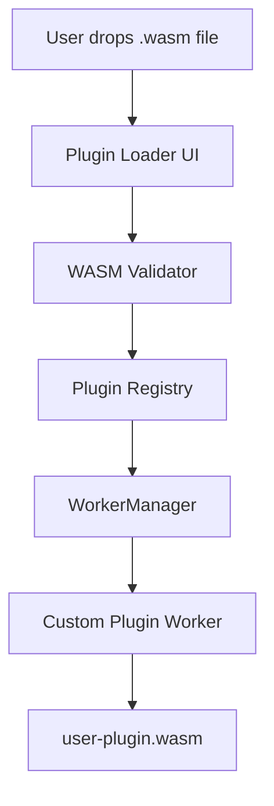

# Spec: Phase 7 — Custom WASM Plugin Runtime

## 1. Overview
Phase 7 enables advanced users and enterprises to load their own WASM modules into LocalMind, extending the platform with proprietary data processing capabilities. The runtime provides a sandboxed execution environment with a typed message-passing API.

## 2. Architecture



## 3. Plugin Manifest
Each user-provided WASM plugin must be accompanied by a `plugin.json` manifest:

```json
{
  "name": "My Custom Parser",
  "version": "1.0.0",
  "description": "Parses proprietary binary sensor logs",
  "author": "Acme Corp",
  "entrypoints": {
    "process": {
      "description": "Process a raw binary buffer",
      "input": "ArrayBuffer",
      "output": "ArrayBuffer"
    }
  },
  "permissions": ["read_data", "write_result"],
  "wasm_file": "plugin.wasm"
}
```

## 4. Plugin API Contract
The custom WASM module must export the following functions (compatible with `wasm-bindgen` or raw WASM exports):

```typescript
// Exported from user's WASM module
interface CustomPluginExports {
    alloc(size: number): number;   // malloc-like allocation
    dealloc(ptr: number): void;    // free allocation
    process(ptr: number, len: number): number; // returns output ptr
}
```

The Plugin Runtime wraps these exports with a TypeScript adapter:

```typescript
export interface CustomPluginContract {
    init(): Promise<void>;
    process(inputBuffer: ArrayBuffer): Promise<ArrayBuffer>;
    getMetadata(): Promise<PluginManifest>;
}
```

## 5. Sandboxing & Security
1. **No DOM access:** Custom WASM runs in a dedicated Worker — it cannot access the DOM, main thread, or Svelte stores.
2. **Memory isolation:** The plugin's linear memory is isolated from all other workers.
3. **No fetch():** Custom Workers must have `{ fetch: false }` CSP. Plugins cannot make network requests.
4. **WASM validation:** Before loading, run `WebAssembly.validate(buffer)` to reject malformed binaries.
5. **Permission model:** Only the entrypoints declared in `plugin.json` are callable from the UI.

## 6. Plugin Registry UI
- A "Plugin Manager" section in Settings.
- "Install Plugin" — drop zone for `.wasm` + `plugin.json` pair.
- Lists installed plugins with: name, version, author, status (enabled/disabled).
- "Remove" button — terminates the worker and removes from registry.
- Installed plugins are listed in the WorkerManager and available as callable tools from other workspaces (e.g., the Transformation Pipeline in Phase 4).

## 7. Invariants
1. Plugin WASM files are stored in OPFS under `plugins/{plugin-id}/plugin.wasm`.
2. A plugin crash (WASM trap) must not crash the main app — Workers are isolated processes.
3. Each plugin runs in its own dedicated Worker — two plugins cannot share a Worker thread.
4. Plugin output is always an `ArrayBuffer` — type coercion to display formats is handled by the host UI.
