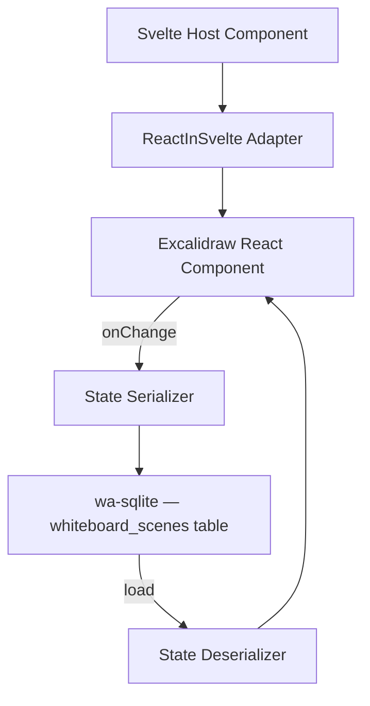

# Spec: Phase 8 — Infinite Whiteboard Integration (Excalidraw)

## 1. Overview
Phase 8 integrates an infinite, offline-first whiteboard into LocalMind — enabling users to create investigation maps, architecture diagrams, and visual notes, with all whiteboard data persisted locally via wa-sqlite.

## 2. Engine
- **Excalidraw** (`@excalidraw/excalidraw`) — an open-source React/Canvas whiteboard library, embedded inside a Svelte component via a thin React adapter.

## 3. Architecture



## 4. Data Storage
Extend wa-sqlite schema:
```sql
CREATE TABLE IF NOT EXISTS whiteboard_scenes (
    id TEXT PRIMARY KEY,
    workspace_id TEXT REFERENCES workspaces(id) ON DELETE CASCADE,
    name TEXT NOT NULL,
    scene_data TEXT NOT NULL, -- JSON-serialized Excalidraw elements
    thumbnail BLOB,           -- PNG thumbnail of the current state
    updated_at INTEGER DEFAULT (unixepoch())
);
```

## 5. Features

### 5.1 Investigation Map Mode
- Special "sticky note" templates for LocalMind integration points:
  - "File Node" — links to a registered file in the DuckDB workspace.
  - "Query Node" — shows a SQL query and its result count.
  - "AI Insight Node" — attaches a saved AI-generated insight.
- These nodes are read-only data snapshots; clicking them navigates to the relevant LocalMind tool.

### 5.2 Collaboration (Post-MVP)
- Phase 8 is single-user only. Multi-user real-time collaboration is a future enterprise feature.

## 6. Invariants
1. **Excalidraw state is never sent to any server** — it is persisted only in wa-sqlite (OPFS).
2. `onChange` is debounced at 1 second before writing to wa-sqlite — avoid thrashing on every mouse move.
3. The Excalidraw component must render inside a Web Worker boundary — it runs on the main thread (Canvas API requires it), but scene state serialization/persistence must be async.
4. Exporting a whiteboard as SVG or PNG uses Excalidraw's built-in export API.
