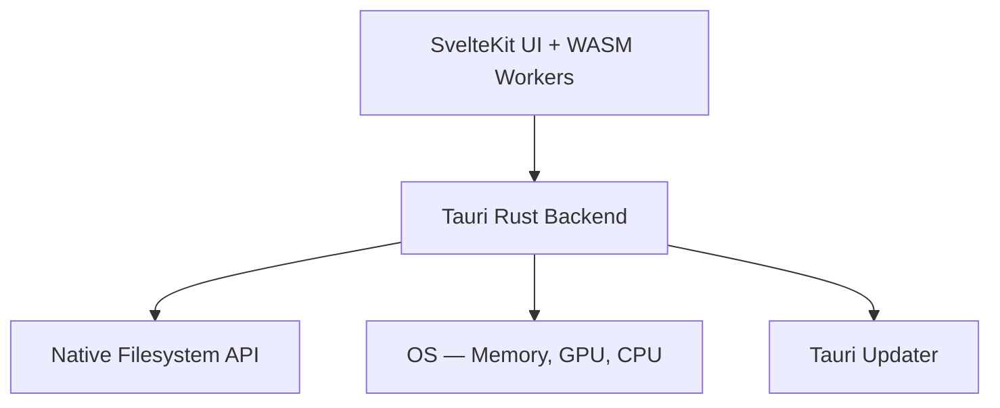

# Spec: Phase 9 — Pro Tier (Tauri Desktop App)

## 1. Overview
The LocalMind Pro desktop application wraps the existing SvelteKit + WASM architecture inside a **Tauri** (Rust) shell. The UI and WASM workers are identical to the web version — Tauri simply removes browser sandbox restrictions and adds native OS capabilities.

## 2. Why Tauri, Not Electron
| Criteria | Tauri | Electron |
|---|---|---|
| Binary size | ~5–15MB | ~150–300MB |
| Memory usage | Low (native WebView) | High (bundled Chromium) |
| Security model | Allowlist-based Rust backend | Broad Node.js access |
| Startup time | ~200ms | ~2–4s |

## 3. Architecture

## 4. New Capabilities Unlocked

### 4.1 Native Filesystem Access
- Replace `showOpenFilePicker()` with Tauri's `tauri::dialog::open()` for a native OS file picker.
- Enable direct file streaming without browser 2GB memory limits.
- Allow watching a directory for changes via `tauri-plugin-fs-watch`.

### 4.2 Unlimited Memory
- Remove browser memory caps — processing 50GB log files becomes feasible.
- DuckDB WASM can use the full system RAM for query execution.

### 4.3 Auto-Update
- Use `tauri-plugin-updater` to check for new LocalMind versions on startup.
- Show an update banner with changelog notes.

### 4.4 Native Notifications
- Use `tauri-plugin-notification` to notify the user when a long-running job (FFmpeg transcode, bulk OCR) completes — even if the window is minimized.

## 5. Platform Targets
| Platform | Format |
|---|---|
| macOS | `.dmg` + `.app` (Universal Binary: Intel + Apple Silicon) |
| Windows | `.exe` (NSIS installer) + `.msi` (WiX) |
| Linux | `.AppImage` + `.deb` |

## 6. Build Configuration (`tauri.conf.json` constraints)
- `allowlist.fs`: enable only `readFile`, `writeFile`, `readDir` — disable `removeDir`, `removeFile`.
- `allowlist.shell`: disabled entirely — no shell command execution from the Svelte frontend.
- `allowlist.http`: disabled — all network calls go through the existing LLM Worker's `fetch()`.
- CSP: must still include COOP/COEP equivalents via Tauri's custom protocol headers.

## 7. Invariants
1. The SvelteKit codebase is **shared** with the web version — no Tauri-specific UI code in components.
2. Tauri-specific logic lives exclusively in `src-tauri/` and a thin `src/lib/tauri-bridge.ts` adapter.
3. The `tauri-bridge.ts` adapter provides the same interface as `window.showOpenFilePicker()` — components call the bridge, not Tauri directly.
4. The Tauri app must pass the same Playwright E2E suite as the web version.
